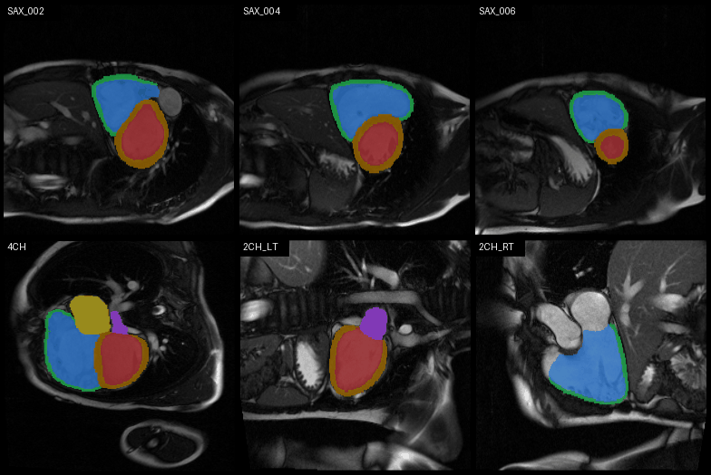
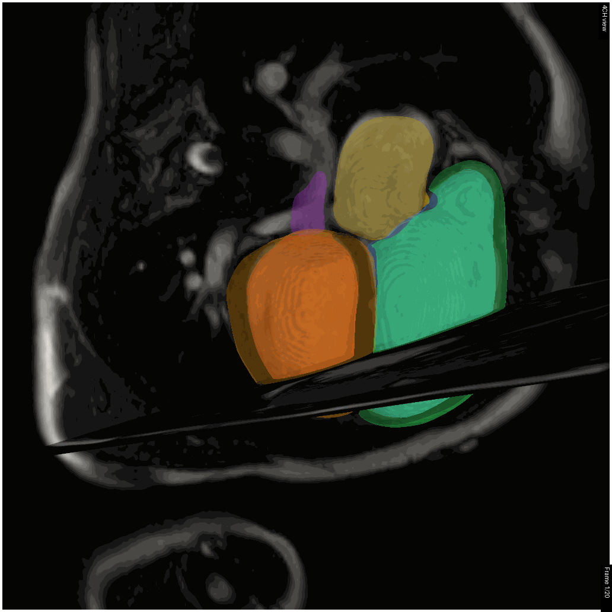

# Filling the Gaps: 4D Dense Cardiac Anatomy from Sparse CMR for Tetralogy of Fallot Assessment
 
A two-stage deep learning pipeline for reconstructing dense 3D whole-heart segmentations from sparse 2D cine CMR images in patients with repaired Tetralogy of Fallot (rToF).
 
> The label completion logic is adapted from [XESchong/label_completion_pipeline](https://github.com/XESchong/label_completion_pipeline), with the following key additions:
> - **ToF-specific weights** — retrained for Tetralogy of Fallot pathologies
> - **Expanded label set** — additional cardiac structures beyond the original implementation
> - **Sparse input handling** — robust to highly incomplete segmentations
 
---

 ## Citation
 
If you use this code in your research, please cite:

Mauger, Charlene, et al. "Filling the Gaps: Generating 4D Dense Cardiac Anatomy from Sparse CMR for Enhanced Tetralogy of Fallot Assessment." Journal of Cardiovascular Magnetic Resonance (2026). https://doi.org/10.1016/j.jocmr.2026.102765


Xu, Yiyang, et al. "Improved 3D whole heart geometry from sparse CMR slices."
International Workshop on Statistical Atlases and Computational Models of the Heart.
Cham: Springer Nature Switzerland, 2024.
 
---

## Table of Contents
 
- [Pipeline Overview](#pipeline-overview)
- [Installation](#installation)
- [Usage](#usage)
  - [Full pipeline (end-to-end)](#full-pipeline-end-to-end)
  - [Step 1 — Generate segmentation masks](#step-1--generate-segmentation-masks)
  - [Step 2 — Reconstruct dense 3D volumes](#step-2--reconstruct-dense-3d-volumes)
- [Citation](#citation)
- [Contact](#contact)
---
 
## Pipeline Overview
 
Standard clinical CMR acquires sparse 2D slices with anisotropic resolution, inter-slice gaps, and motion artifacts — challenges that are amplified in paediatric populations where incomplete acquisitions are common. This pipeline uses CT-derived 3D segmentations to train a reconstruction network, bridging CMR's clinical accessibility with CT's spatial resolution — without requiring rToF CT data at inference time.
 
```
2D Cine CMR (short + long axis)
        │
        ▼
┌─────────────────────┐
│  UNet Segmentation  │   ← trained on multi-centre rToF CMR
└─────────────────────┘
        │
   Sparse 2D labels
        │
        ▼
┌──────────────────────────┐
│  Label Completion Network │   ← trained on 1,715 CT segmentations
└──────────────────────────┘        + synthetic RV myocardium
        │                           + simulated ToF-specific views
        ▼
Dense 3D Whole-Heart Segmentation
(LV, RV, LVmyo, RVmyo, LA, RA)
```
 
### Key Features
 
- **Robust to missing data** — validated with 50–70% of short-axis slices randomly removed, simulating incomplete paediatric acquisitions
- **RV myocardium reconstruction** — critical for risk stratification in rToF; absent from prior CMR-based reconstruction methods
- **Cross-modality training** — CT data augmented with synthetic RV myocardium and ToF-specific views, removing the need for large-scale rToF CT datasets
- **Cardiac cycle generalisation** — reconstructs geometries throughout the cardiac cycle despite training only on diastasis frames
- **Multi-centre validation** — tested on clinical CMR data from multiple centres with real motion artifacts
---
 
## Installation
 
The recommended setup uses the provided conda environment (Python 3.11).
 
### Step 1 — Clone the repository
 
```bash
git clone https://github.com/charlenemauger1/tof_label_completion.git
```
 
Alternatively, use a GUI client such as [GitHub Desktop](https://desktop.github.com/download/) or [GitKraken](https://www.gitkraken.com/). If prompted to initialise submodules after cloning, **select no** — these will be initialised in Step 4.
 
### Step 2 — Create the conda environment
 
Requires [Anaconda](https://www.anaconda.com/docs/getting-started/anaconda/install) or [Miniconda](https://www.anaconda.com/docs/getting-started/miniconda/main).
 
```bash
cd tof_label_completion
conda create -n completeme-311 python=3.11
conda activate completeme-311
```
 
### Step 3 — Install the package
 
```bash
pip install -e .
```
 
### Step 4 — Download pretrained model weights
 
All checkpoints are hosted on Hugging Face: [charlenemauger1/complete-me](https://huggingface.co/charlenemauger1/complete-me)
 
```bash
python download_pretrained_weights.py
```
 
This downloads segmentation models into `src/completeme/segmentation/checkpoints/` and the label completion network into `src/completeme/label_completion/checkpoints/`.
 
### Step 5 — Install PyTorch
 
PyTorch is not bundled in the environment. Visit the [PyTorch installation page](https://pytorch.org/get-started/locally/) and follow the instructions for your GPU and OS.
 
---
 
## Usage
 
### Full pipeline (end-to-end)
 
`run_full_pipeline.py` orchestrates both steps in sequence — segmentation followed by label completion — with a single command.
 
```bash
python run_full_pipeline.py \
    --input_dir ./example/nifti \
    --output_dir ./output \
    --log
```
 
Segmentation masks are written to `<output_dir>/segmentation_masks/` and final dense volumes to `<output_dir>/3d_dense_volumes/`.
 
**Available flags:**
 
| Flag | Default | Description |
|---|---|---|
| `--input_dir` | *(required)* | Root folder of per-patient CMR NIfTI files |
| `--output_dir` | `./pipeline_output` | Root folder for all outputs |
| `--seg_dir` | `<output_dir>/segmentation_masks` | Override intermediate segmentation output location |
| `--log` | off | Write a `pipeline.log` file to `--output_dir` |
| `--skip_segmentation` | off | Skip Step 1 and use existing masks in `--seg_dir` (useful when re-running after a Step 2 failure) |
 
---
 
### Step 1 — Generate segmentation masks
 
`run_batch_segmentation.py` runs the segmentation network on CMR NIfTI files and outputs segmentation masks. The correct model is selected automatically based on the view keyword in each filename (`SA`, `4CH`, `2CH_LT`, `2CH_RT`, `3CH`, `RVOT`).
 
**Input format:** Each `.nii.gz` is a 2D+t cine volume `(x, y, time frames)`. Short-axis data should have one file per slice position.
 
```
input_folder/
├── patient_001/
│   ├── *SA*.nii.gz        ← required; one file per slice position
│   ├── *4CH*.nii.gz       ← required
│   ├── *2CH_LT*.nii.gz    ← optional
│   ├── *2CH_RT*.nii.gz    ← optional
│   ├── *3CH*.nii.gz       ← optional
│   └── *RVOT*.nii.gz      ← optional
├── patient_002/
│   └── ...
```
 
**Run on the provided example:**
 
```bash
python ./src/completeme/segmentation/run_batch_segmentation.py \
    -b ./example/nifti/ \
    -o ./tof_mask
```
 
Expected output matches `./example/segmented-nifti/` and should look like this:
 

 
---
 
### Step 2 — Reconstruct dense 3D volumes
 
`run-pipeline.py` takes the sparse segmentation masks from Step 1 and produces dense 3D volumes. It handles data cleaning, slice alignment (SSA), and 3D interpolation.
 
**Input format:** the segmentation masks produced in Step 1, organised by patient folder.
 
```
input_folder/
├── patient_001/
│   ├── *SA*.nii.gz
│   ├── *4CH*.nii.gz
│   └── ...
├── patient_002/
│   └── ...
```
 
**Run on the provided example:**
 
```bash
python ./src/completeme/label_completion/run-pipeline.py \
    --all_components \
    --input_dir ./example/segmented-nifti \
    --output_dir ./output_volume \
    --log
```
 
Output is saved under `<output_dir>/3d_dense_volumes/`.
 

 
#### Running individual pipeline stages
 
Instead of `--all_components`, you can run each stage separately:
 
| Flag | Description |
|---|---|
| `--preprocessing` | Clean and convert data to multiframe format |
| `--slice_shifting` | Perform Slice Shift Alignment (SSA) |
| `--volume_conversion` | Convert aligned slices into 3D sparse volumes |
| `--sparse_to_dense` | Interpolate sparse data into a final dense 3D volume |
 
---
 
## Contact
 
For questions or issues, please [open a GitHub issue](https://github.com/charlenemauger1/tof_label_completion/issues) or email [charlene.1.mauger@kcl.ac.uk](mailto:charlene.1.mauger@kcl.ac.uk).
