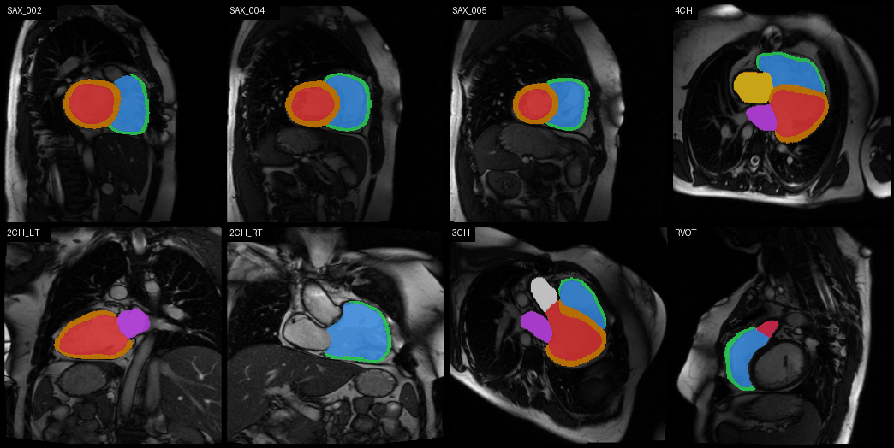

# Filling the Gaps: Generating 4D Dense Cardiac Anatomy from Sparse CMR for Enhanced Tetralogy of Fallot Assessment

A two-stage deep learning pipeline for reconstructing dense 3D whole-heart segmentations from sparse 2D cine CMR images in repaired Tetralogy of Fallot (rToF) patients.

## Table of Contents
- [**Pipeline**](#pipeline-overview)
- [**Installation**](#installation-guide)
- [**Generating dense segmentation from sparse nifti**](#how-to-run-the-pipline)
    - [Example usage - full pipeline](#example-usage)
    - [Generate segmentation masks from sparse nifti](#generate-segmentations-from-sparse-nifti)
    - [Generate dense segmentation from sparse segmentation mask](#generate-dense-segmentation-from-sparse-segmentation-mask)
- [**Contact**](#contact) 


For a detailed description of this pipeline, please refer to:

    Mauger et al.

For a detailed description regarding the label completion, please refer to:

    Yiyang et al.
 add link to yiyang's repo
Depending on how you use this repo, please cite the relevant publication(s) above.


## Pipeline Overview

Standard clinical CMR acquires sparse 2D slices with anisotropic resolution, inter-slice gaps, and motion artifacts — challenges amplified in paediatric populations where incomplete acquisitions are frequent. This pipeline leverages CT-derived 3D segmentations to train a reconstruction network that bridges CMR's clinical accessibility with CT's spatial resolution, without requiring rToF CT data at inference.

```
2D Cine CMR (short + long axis)
        │
        ▼
┌─────────────────────┐
│  UNet Segmentation  │   ← trained on multi-centre rToF CMR
└─────────────────────┘
        │
   Sparse 2D labels
        │
        ▼
┌──────────────────────────┐
│  Label Completion Network │   ← trained on 1,715 CT segmentations
└──────────────────────────┘        + synthetic RV myocardium
        │                           + simulated ToF-specific views
        ▼
Dense 3D Whole-Heart Segmentation
(LV, RV, LVmyo, RVmyo, LA, RA)
```


### Key Features
 
- **Robust to missing data** — validated with 50–70% of short-axis slices randomly removed, simulating incomplete paediatric acquisitions
- **RV myocardium reconstruction** — critical for risk stratification in rToF and absent from prior CMR-based reconstruction methods
- **Cross-modality training** — CT data augmented with synthetic RV myocardium and ToF-specific views, removing the need for large-scale rToF CT datasets
- **Cardiac cycle generalisation** — reconstructs geometries throughout the cardiac cycle despite training only on diastasis frames
- **Multi-centre validation** — tested on clinical CMR data from multiple centres with real motion artifacts


## Installation Guide

The easiest way to set up this repository is using the provided conda environment (Python 3.11). Follow steps 1–5 below to create and activate the `completeme-311` environment.

### Step 1: Clone this repository
In a Git-enabled terminal, run:

```bash
git clone https://github.com/charlenemauger1/tof_label_completion.git
```
Alternatively, you can use a GUI client such as [GitHub Desktop](https://desktop.github.com/download/) or [GitKraken](https://www.gitkraken.com/) to clone the repository. If prompted to initialise submodules after cloning, **select no** — these will be initialised in Step 4.

Step 2: Set Up the Virtual Environment
If you have [Anaconda](https://www.anaconda.com/docs/getting-started/anaconda/install) or [miniconda](https://www.anaconda.com/docs/getting-started/miniconda/main) installed, create and activate the conda environment by running the following in your terminal (or Anaconda Command Prompt on Windows):

```bash
cd tof_label_completion
conda create -n completeme-311 python=3.11
conda activate completeme-311
```

### Step 3: Install the complete-me Packages
With the conda environment active, navigate to the cloned repository and install the required packages:

```bash
pip install -e .
```

### Step 4: Download Pretrained Models
All model checkpoints are available on Hugging Face: [charlenemauger1/complete-me](https://huggingface.co/charlenemauger1/complete-me)

To download the pretrained weights:

```python
python download_pretrained_weights.py
```

This script downloads the pretrained model checkpoints from Hugging Face into the exact directory structure expected by the pipeline — segmentation models into `src/completeme/segmentation/checkpoints/` and the label completion network into `src/completeme/label_completion/checkpoints/`.  

### Step 5: Install PyTorch
This project requires PyTorch, which is not included in the default `completeme-311` environment. Visit the [**PyTorch installation page**](https://pytorch.org/get-started/locally/) and follow the instructions for your GPU and operating system.


## How to run the pipeline


## Generate segmentations from sparse nifti

`run_batch_segmentation.py` runs the segmentation network on CMR NIfTI images and outputs segmentation masks. It automatically selects the correct model based on the view keyword in the filename (`SA`, `4CH`, `2CH_LT`, `2CH_RT`, `3CH`, `RVOT`).
Each `.nii.gz` is a 2D+t cine volume (x, y, time frames). The short-axis stack has one file per slice position. Input files should be organised as follows:

```bash
input_folder/
    ├── patient_001/
    │   ├── *SA*.nii.gz        # required
    │   ├── *SA*.nii.gz        # optional
    │   ├── *SA*.nii.gz        # optional
    │   ├── [...]              # optional    
    │   ├── *4CH*.nii.gz       # required
    │   ├── *2CH_LT*.nii.gz    # optional
    │   ├── *2CH_RT*.nii.gz    # optional
    │   ├── *3CH*.nii.gz       # optional
    │   └── *RVOT*.nii.gz      # optional
    ├── patient_002/
    │   └── ...
```

To run the segmentation network on the provided example, run the following command
```bash
python ./src/completeme/segmentation/run_batch_segmentation.py -b ./example/nifti/ -o ./tof_mask
```

The resulting segmentations should be identical to the ones in the `./example/segmented-nifti/` and look like this: 

 

## Contact
For questions or issues, please open an issue on GitHub or contact [charlene.1.mauger@kcl.ac.uk](charlene.1.mauger@kcl.ac.uk) 
